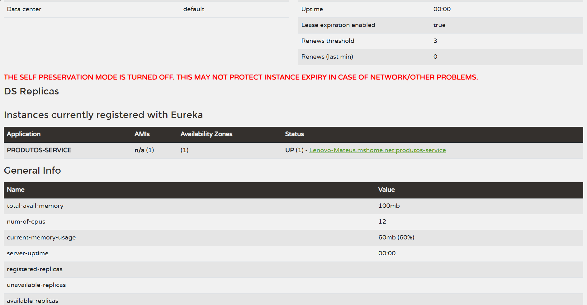
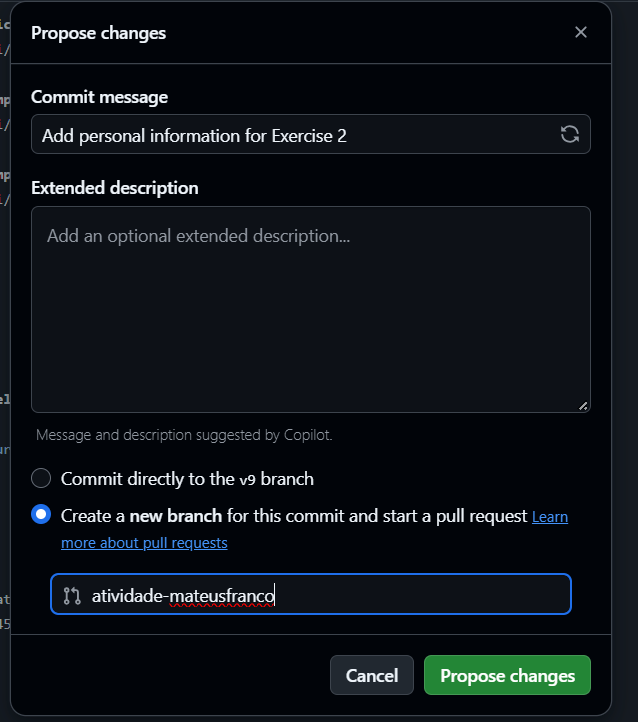
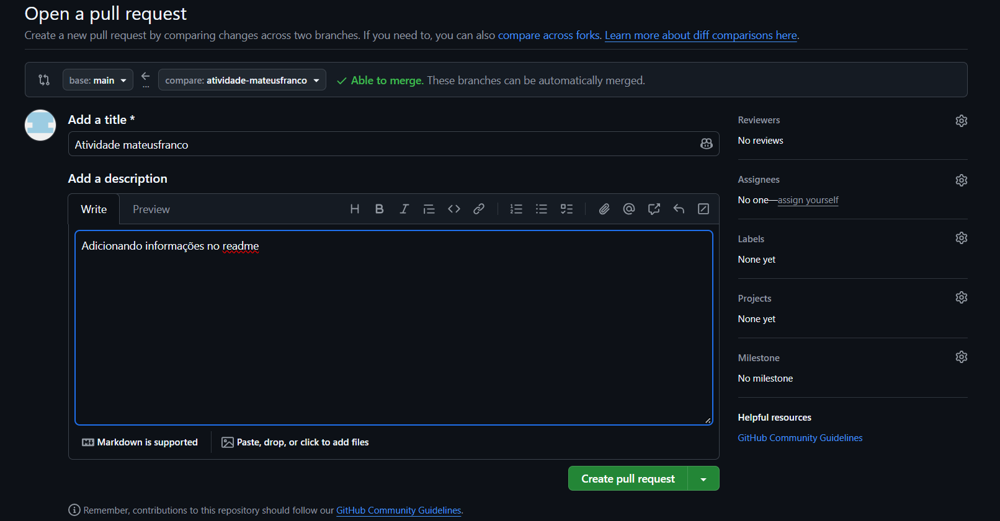
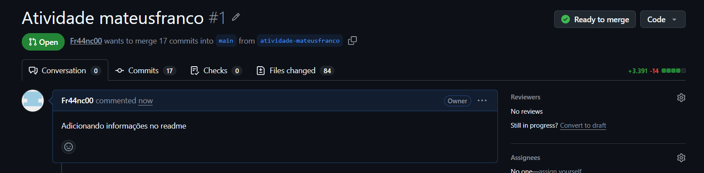
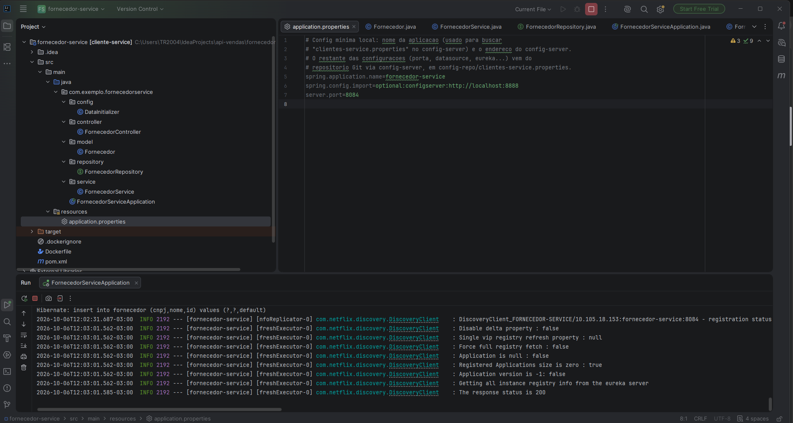
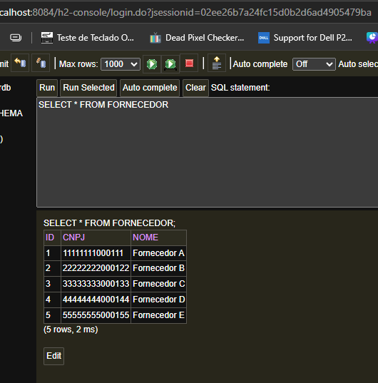

# Documentação Microserviços
https://claude.ai/code/artifact/2c541174-0b49-486d-9ee2-1682e91b8daf

# Documentação implementação Docker GUIA
https://claude.ai/code/artifact/a5f3c8e5-81de-4791-a16c-a71d4aa45f0f

# Documentação implementação Kubernetes GUIA
https://claude.ai/code/artifact/68cd2944-af3d-430f-8e6f-ea27c4186982

---

# AT

## Exercício 1

### Captura de tela do serviço registrado

---

## Exercício 2

Nome completo: Mateus Franco Soares
Matrícula: "123.456.789-01" (não quero mostrar meu CPF num repositório público)

### Capturas de tela do Pull Request

---

---

---

## Exercício 3

### Captura de tela do terminal mostrando o microsserviço funcionando

---

## Exercício 4

### Captura de tela dos registros no banco H2

